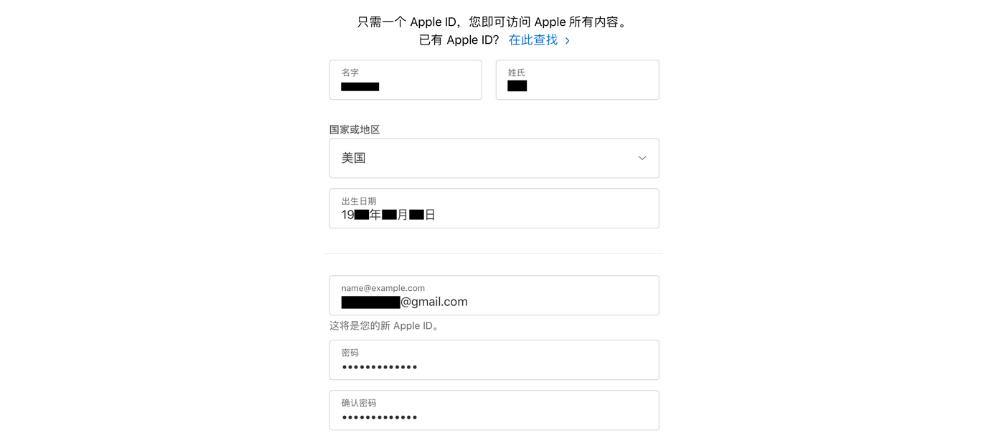
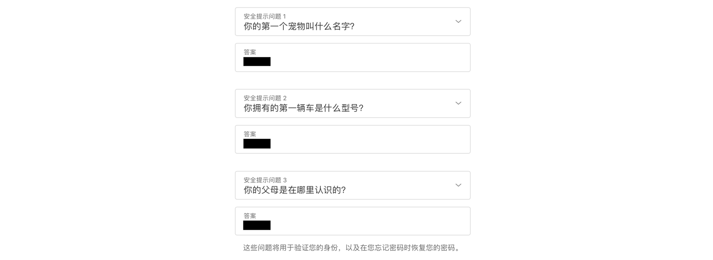
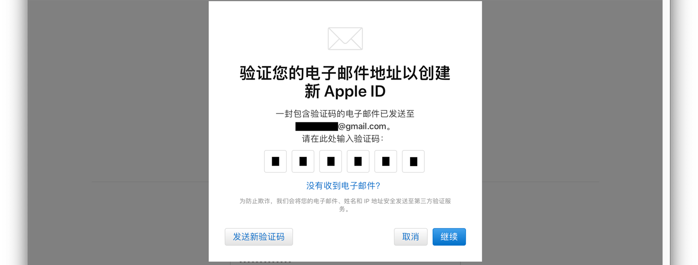
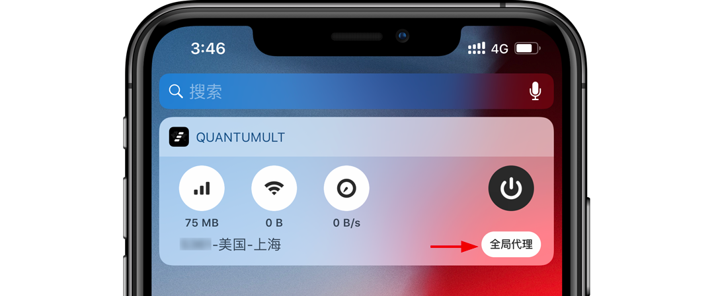
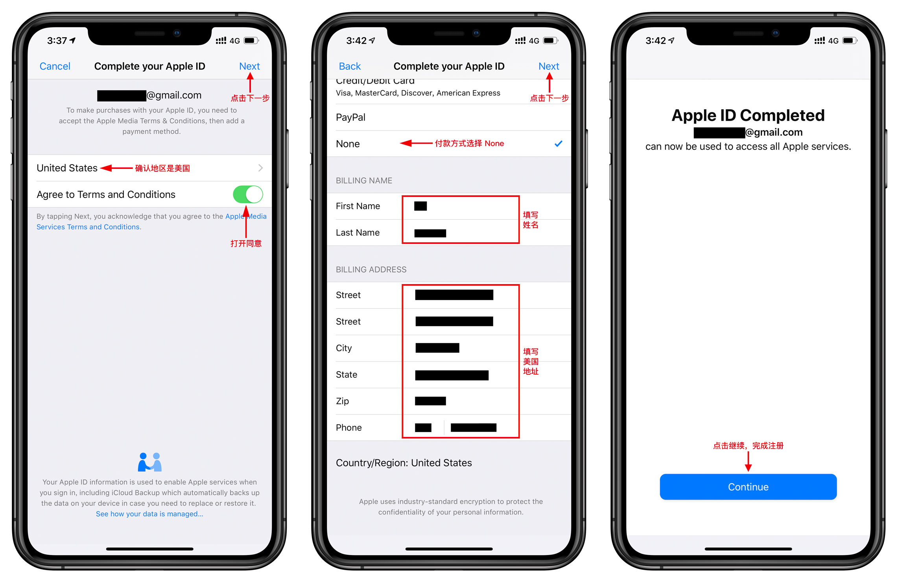

# 注册美区 Apple ID 教程

### 准备

* 未注册过 Apple ID 的邮箱
* 美国节点

***

### 步骤一：创建新的 Apple ID

前往 [Apple ID](http://appleid.apple.com/) ，点击「创建您的 Apple ID」，填入姓名、国家选择美国、生日、邮箱、密码、电话号码。

选择安全提示问题，并填入答案，点击「继续」。

输入电子邮件收到的验证码，点击「继续」注册完成。

***

### 步骤二：验证 Apple ID

开启美国节点，设为全局代理。

App Store 登陆新注册的美区 Apple ID，会跳出验证信息点击「Review」。

1. 确认国家是 United States > 打开 Agree to Terms and Conditions > 点击 Next

2. 付款方式选择 None > 填写姓名，美国地址 > Next > 点击 Continue 完成验证。

> 注1：[美国地址生成器](http://www.haoweichi.com)
> 注2：也可以绑定美区 PayPal

***

### 购买付费 App

**方案一**：Apple ID 绑定美区 PayPal。

> [注册美区 PayPal 方法](https://github.com/masonincn/PayPal-US)

**方案二**：购买礼品卡，打开 App Store，点选头像 > Redeem Gift Card or Code >  You can also enter your code manually，输入代码完成充值。

---

### Telegram

* 路由器群：[https://t.me/luyouqi](https://t.me/luyouqi)
* V2EX群：[https://t.me/V2EXPro](https://t.me/V2EXPro)
* Apple群：[https://t.me/applequn](https://t.me/applequn)
* Google群：[https://t.me/googlequn](https://t.me/googlequn)
