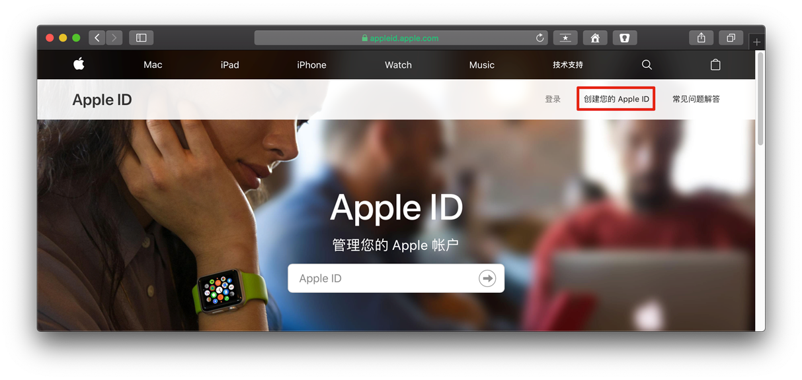
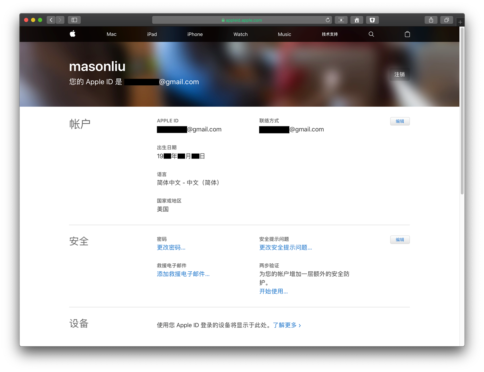
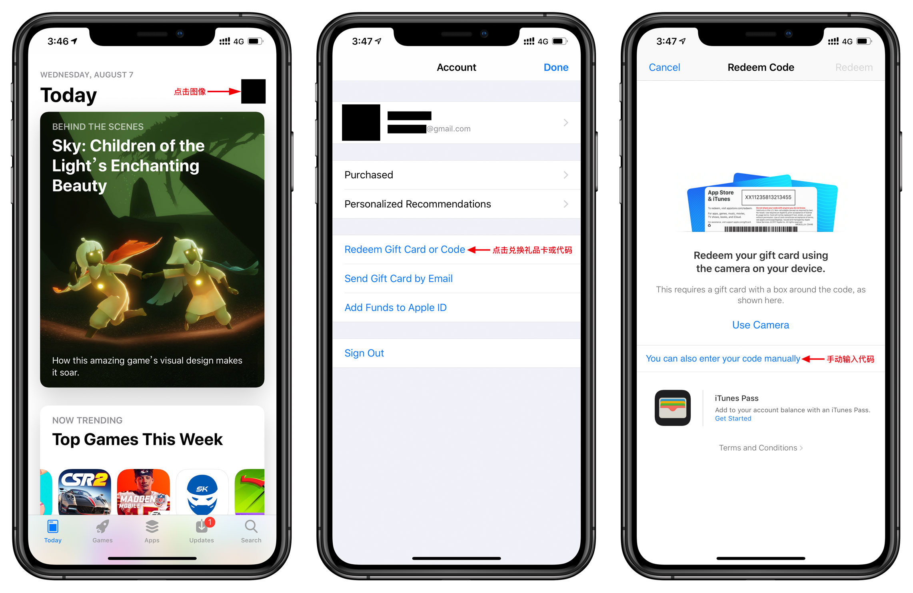

# 注册美区 Apple ID 教程

## 准备

* 没注册过 Apple ID 的邮箱

* iPhone 或 电脑

* 美国路线

***

## 步骤一：创建新的 Apple ID

* 前往 [Apple ID](http://appleid.apple.com/) 网页，点击「创建您的 Apple ID」。

* 填入`姓名`、`生日`、`邮件`、`密码`，**国家选择美国**、**国家选择美国**、**国家选择美国**，重要的事情说三遍！

* 选择安全提示问题，并填入答案，点击「继续」。

> 记住安全提示问题答案

* 输入电子邮件收到的 `6` 位数验证码，点击「继续」。

* 注册完成。

***

## 步骤二：验证 Apple ID

* 开启美国路线，设为全局模式。

* App Store 退出原账户，登陆新注册的美区 Apple ID。

* 跳出验证信息点击「Review」。

* 确认国家是 `United States` ，打开「Agree to Terms and Conditions」同意条款和条件，点击 `Next` 继续。

* 付款方式选择 `None`，填写 `姓名`，`美国地址`，如没有地址建议网上搜索或打开 [美国个人信息生成](http://www.haoweichi.com)，填写完点击 `Next` 。
  
  > * 如美国路线不是全局模式将不会出现 `None` 选项。
  > 
  > * 个人建议填写免税州地址。
  > 
  > * 如果你有美区 PayPal，可以绑定。

* 点击 `Continue` ，完成验证，此时可以安装美区 App。

***

## 购买付费 App

1. Apple ID 绑定美区 PayPal，随时购买任何 App。
   
   > 注册美区 PayPal 方法：[GitHub - masonincn/PayPal-US](https://github.com/masonincn/PayPal-US)

2. 购买礼品卡，打开 App Store，点选头像 > `Redeem Gift Card or Code` >  `You can also enter your code manually`，输入代码完成充值。

